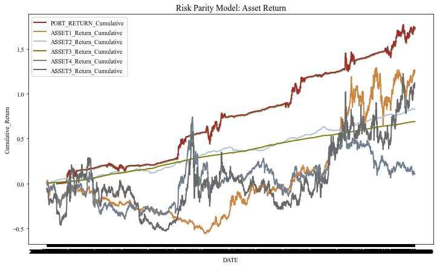
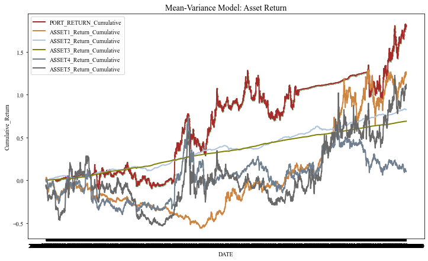
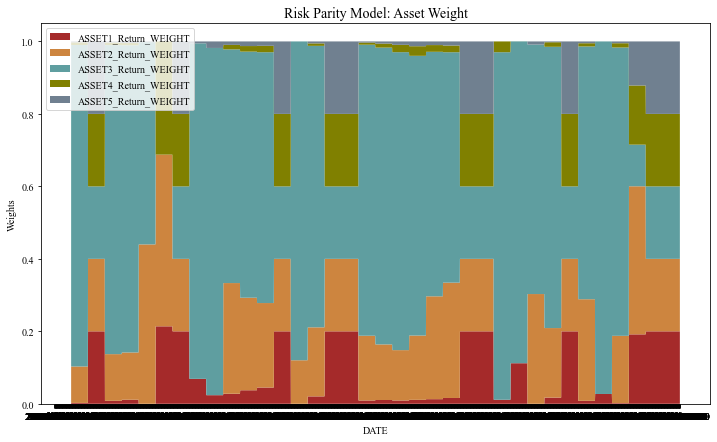
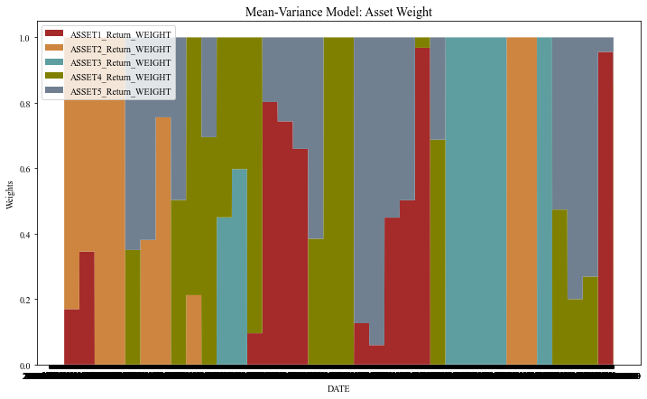

# Application-Supplement
# Multi-Asset Portfolio Allocation Project

## Overview

This project focuses on the creation of two asset allocation models for a multi-asset portfolio. The primary objective is to optimize the allocation of assets to achieve desirable outcomes. The two models utilized in this project are the Risk Parity Model and the Mean-Variance Model.

## Project Components

1. **Data Import and Processing:**  Process asset data based on a list of inner codes and create merged DataFrames and return DataFrames ready for constructing the Risk Parity Model and Mean-Variance Model
```python
def process_assets(innercodes):
    """
    Process asset data based on a list of inner codes and create merged DataFrames
    Return DataFrams ready for constructing the Risk Parity Model and Mean-Variance Model

    Parameters:
    innercodes (list): A list of inner codes for assets to be processed.

    Returns:
    data_MV (DataFrame): DataFrams ready for constructing the Mean-Variance Model
    data_RP (DataFrame): DataFrams ready for constructing the Risk Parity Model
    """
    # Change the current working directory to the specified folder and import files
    folder_path = os.path.dirname(os.path.realpath(__file__))
    os.chdir(folder_path)
    # Ingest data from csv
    secumain_df = pd.read_csv("secumain.csv", encoding="gbk")
    qt_commindexquote_df = pd.read_csv("qt_commindexquote.csv")
    qt_indexquote_df = pd.read_csv("qt_indexquote.csv")
    bond_bondindexquote_df = pd.read_csv("bond_bondindexquote.csv")
    # Process dataframes
    asset_df = pd.concat(
        [qt_commindexquote_df, qt_indexquote_df, bond_bondindexquote_df], axis=0
    )
    data_frames = []
    for i, inner_code in enumerate(innercodes, 1):
        # Create a data frame for the asset
        asset_index = (
            secumain_df.merge(asset_df, on="InnerCode", how="inner")
            .query(f'TradingDay >= "2010-01-01" and InnerCode == {inner_code}')
            .rename(
                columns={
                    "ChiName": f"ASSET{i}_Name",
                    "InnerCode": f"ASSET{i}_Code",
                    "TradingDay": "DATE",
                    "ClosePrice": f"ASSET{i}_ClosePrice",
                }
            )
        )
        asset_index[f"ASSET{i}_Return"] = asset_index[
            f"ASSET{i}_ClosePrice"
        ].pct_change()
        data_frames.append(asset_index)
    merged_df = data_frames[0]
    for df in data_frames[1:]:
        merged_df = pd.merge(merged_df, df, on="DATE", how="inner")
    data_MV = merged_df
    data_RP = merged_df
    return data_MV, data_RP


3. **Financial Evaluation Indicators:** To evaluate the performance of the asset allocation models, various financial evaluation indicators are calculated. These indicators provide insights into the risk and return characteristics of the portfolio.

4. **Risk Parity Model:** The Risk Parity Model aims to distribute assets in a way that minimizes risk while maintaining a balanced allocation. The model calculates portfolio weights and performance indicators over time.

5. **Mean-Variance Model:** The Mean-Variance Model seeks to maximize return while considering the trade-off between risk and return. Similar to the Risk Parity Model, it calculates portfolio weights and performance indicators.

6. **Rolling Window Strategy:** Both allocation models are applied using a rolling window approach. This approach involves generating portfolio weights, returns, and net asset values for different time intervals, allowing for dynamic asset allocation.

7. **Cumulative Returns:** Cumulative returns are calculated to visualize the performance of the portfolio over time. These visuals provide insights into the effectiveness of the allocation models.

8. **Visualizations:** The project includes functions for plotting and visualizing cumulative returns and portfolio weights over time. These visualizations are essential for understanding the performance of the portfolio.

## Results
The project includes functions for plotting and visualizing cumulative returns and portfolio weights over time. These visualizations are essential for understanding the performance of the portfolio.

   - Risk Parity Model: Asset Return
     

   - Mean-Variance Model: Asset Return
     

   - Risk Parity Model: Asset Weight
     

   - Mean-Variance Model: Asset Weight
     

...


## Conclusion

This project aims to optimize asset allocation for a multi-asset portfolio by employing two distinct models: the Risk Parity Model and the Mean-Variance Model. It encompasses data processing, the calculation of financial evaluation indicators, and the generation of visualizations to assess the performance of these allocation strategies.

The project provides a comprehensive approach to asset allocation and financial analysis, offering insights into the trade-offs between risk and return. It is a valuable resource for individuals and organizations seeking to make informed investment decisions and achieve their financial goals.

For code details and implementation, please refer to the provided code in the Python script.
